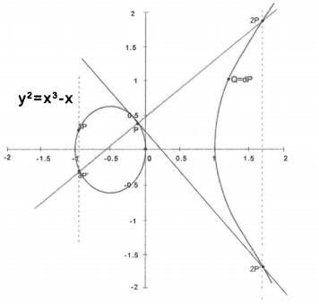

**保密通信模型**

相关概念：

* 明文：不需要任何解密工具就可以读懂内容的原始消息。
* 密文：明文换成一种在通常情况下无法读懂的内容，这种隐蔽后的信息成为密文。
* 加密：由明文到密文的变换过程。
* 解密：由密文到明文的变换过程。
* 加解密算法：对明文转换为密文采取的一组规则称作加密算法，反之称为解密算法。
* 密钥：密钥在明文转换为密文或密文转换为明文的算法中输入的参数。

**密码算法分类**

* 受限制的算法和基于密匙的算法

  基于密钥的安全性，且其算法细节可以公开，算法可以抵御公众的分析和 破解企图

* 对称密码和非对称密码

  对称密码算法：加密密钥和解密密钥相同。

  非对称密码体制：由公开密钥和私有密钥组成。成对使用。

* 分组密码和流密码

  分组密码：将明文分成固定长度的组，用同一密钥和算法对每一块加密，对每个输入块产生一个输出块，输出也是固定长度的密文。如：AES、DES

  流密码：将明文消息按照字符逐位加密，基一次加密一个比特或字节。如：一次一密码（One-time padding）

**对称密码算法：**

* 特点：计算量小、加密速度快、效率高。安全信道难以实现，用户量增加，密匙管理难；无法解决消息篡改、否认等问题。

* 分组对称密码：DES、IDEA、AES、RC5、Twofish、CAST-256、MARS等。

* DES：DES 算法把 64 位的明文输入块变为 64 位的密文输出块，它所使用的密钥也是 64 位(有效密钥为56位，第 8、16、24、32、40、48、56、64 位是校验位，使得每个密钥都有奇数个1 )。

  

* 3DES:使用两个56位密钥对数据进行三次加密。密钥长度112，采用加密-解密-加密的形式。

* AES加密：又称Rijndael加密算法。基本要求：比三重DES快而且至少和三重DES一样安全，分组长度为128比特，密钥长度为 128/

  192/256 比特。对应的轮数分别为10/12/14。

  * AES每一轮变换：
    * 字节替换函数
    * 行位移变换函数
    * 列混合变换函数
    * 轮密钥加函数
  * 算法过程

  

* RC4算法

  算法不对明文进行分组处理，而是字节流的方式依次加密明文中的每一个字节，解密的时候也是一次对密文中的每一个字节进行解密。算法密钥长度是可变的。

* BlowFish算法

  算法是一个64位分组及可变密钥长度的对称密钥分组密码算法，可用来加密64比特长度的字符串。

* IDEA算法

  国际数据加密算法，使用128位密钥和8个循环，采用软件实现和硬件实现同样快速。

**非对称密码算法**

* 特点：加密密钥和解密密钥不同，用户和其他N个人通信，只需要获得公开的N个加密密钥（公钥），每个通信方保管好自己的解密密钥（私钥），大大简化了密钥的管理。公钥密码可以加密，也可以签名。

* 缺点：计算复杂、耗用资源大、密文变长。

* RSA算法

  * 过程

  选取两个大素数，计算其乘积 n=pq 和欧拉函数S(n)= (p-1)(q-1) 。然后随机选取加密密钥 l<e< S(n)，满足 e和(p *-1)(q* -1) 互素。最后用欧几里得扩展算法计算解密密钥d，以满足 ed =1(mod(p-1)(q-1)) ，即

  ​                                                            *d* = *e-1mod((p* *-1)(q* *-1))* 

  其中，e和n是公钥，d和n是私钥

  RSA 算法对明文以分组为单位进行加密，每个分组的二进制均小于n。在实际应用中，分组的大小是 位，其中 
  $$
  2^k<n<2^{k+1}
  $$

  ​	
$$
  对明文分组 M，加密过程： C=M^{e}mod n ;
  对密文分组C，解密过程如下 M=C^{d}mod n
$$

  * 举例：

-   RSA算法安全性：关键点在于如何分解n，即得到p和q，既可以算出(p-1)(q-1)，然后基于公开的e得到私钥d。

* SM2算法

  * 介绍：我国的国家密码标准发布，基于ECC（椭圆曲线密码算法）的公钥密码算法。

  * 算法原理：

    基于椭圆曲线方程：
    $$
    y^{2} = x^{3}+ax+b
    $$

通过指定a、b系数，确定唯一的标准曲线。如a=-1，b=0，则椭圆曲线方程为：		
$$
y^{2} = x^{3}-x
$$
图如下：

  * 步骤：

    

    

  * 应用：SM2 算法是公钥算法，可以完成签名、密钥交换以及加密应用。目前在一些金融系统(如银行)得到广泛的应用。

  * 其他SM算法：

    * 对称算法：SM1、SM4、SM7
    * 哈希算法：SM3
    * 非对称算法：SM9

* 其他公钥算法：

  * ElGamal公钥密码算法
  * ECC公钥密码算法

* 其他密码服务：

  * 哈希函数：MD5算法、SHA-1算法

  * 消息认证码：也称消息鉴别码(MAC)，，它利用密钥来生成一个固定长度的短数据块，并将该数据块附加在消息之后。

  * 流程：

    

  * 步骤：

    * A向B发送消息，则A计算MAC，其为消息和密钥的函数，及MAC=Ck(M)。其中，M为输入消息，C是MAC函数，K为共享密钥，MAC表示消息认证码。

    * 消息和认证码一起发送给接收方；
    * 接收方用相同的密钥K进行相同的计算然后比对。
    * 若MAC相等，则：
      * 消息未被修改
      * 消息来自于真正的发送方
      * 信息顺序正确

  * 基本用法：

    * MAC 直接附加在消息之后
    * MAC 直接附加在消息之后，并对整体进行加密
    * 先对消息加密，再对密文生成鉴别码

* 数字签名

  * 概念：指附加在数据单元上的一些数据，或是对数据单元所做的密码变换，这种数据或变换能使数据单元的接收者确认数据单元来源和数据单元的完整性，并保护数据，防止被人伪造。数字签名是非对称密钥加密技术与数字摘要技术的应用。

  * 基本特性：

    * 不可伪造性
    * 不可否认性
    * 消息完整性

  * 类别划分：

    * 消息直接签名、消息压缩后签名
    * 确定性签名、随机化签名

  * 应用实例：

    

    ​	

  